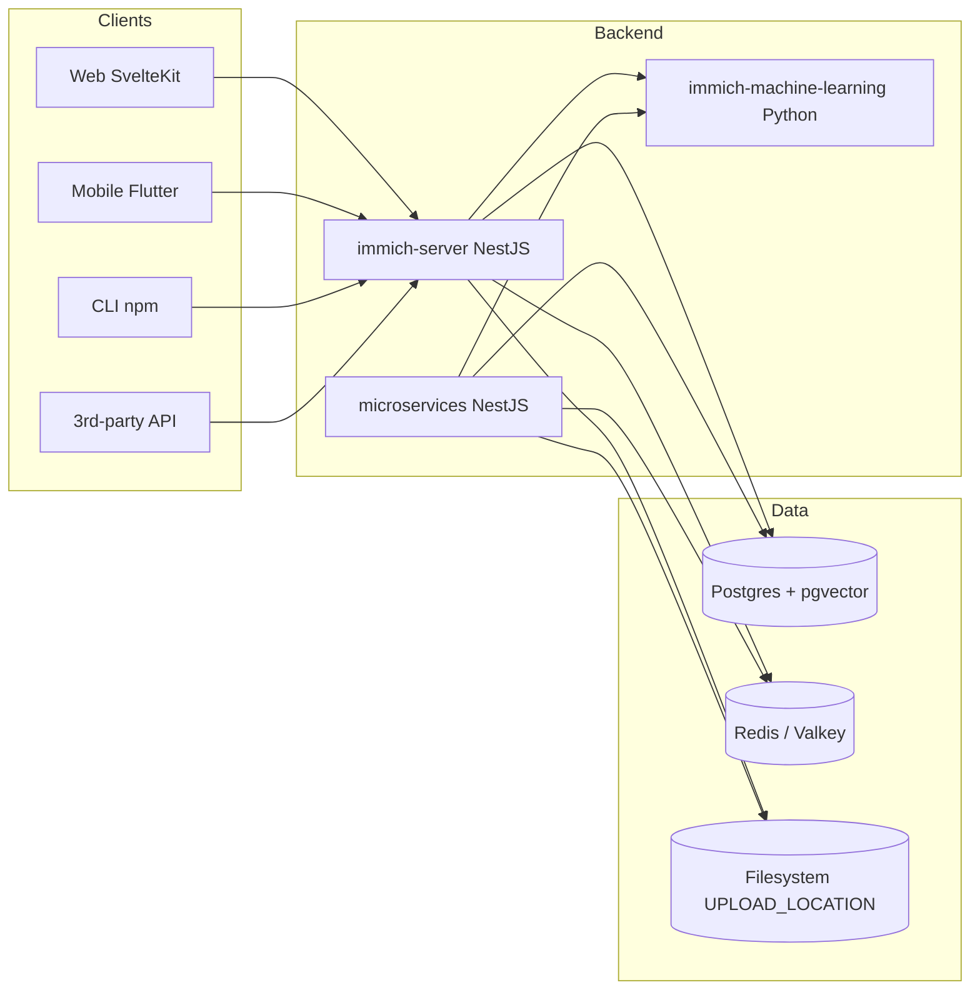
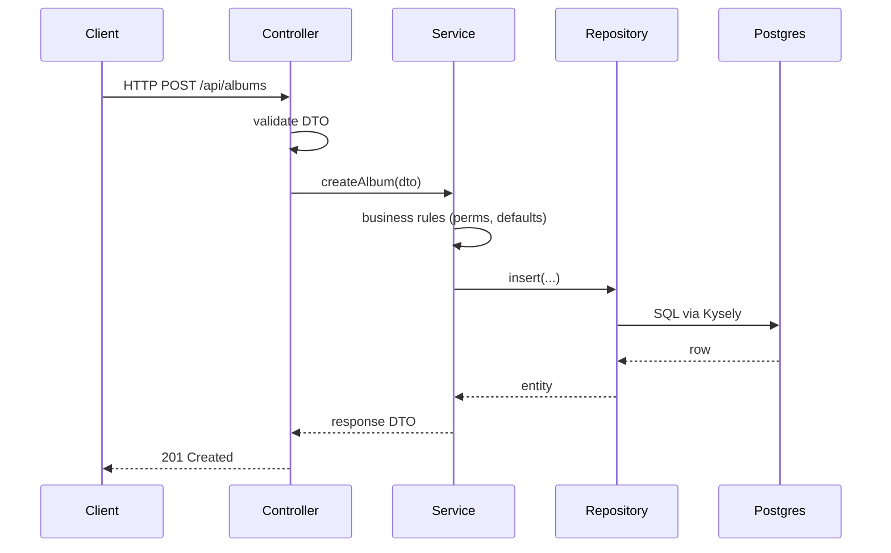
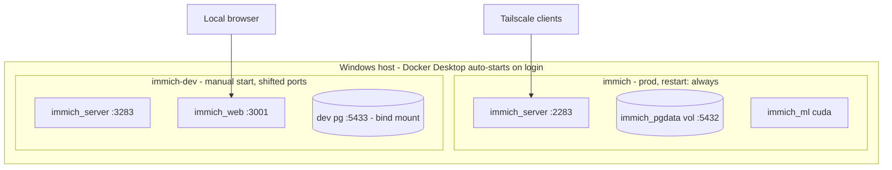

# Architecture (fork view)

A fast tour of the Immich codebase from this fork's perspective. For the full upstream view, read [`docs/docs/developer/architecture.mdx`](../docs/docs/developer/architecture.mdx) — we don't duplicate it here.

## High-level

## Key directories

| Path | What |
|---|---|
| `server/src/controllers/` | HTTP route handlers. Thin — delegate to services. |
| `server/src/services/` | Business logic. The bulk of the backend. |
| `server/src/repositories/` | DB and external-system access. Used by services. Hexagonal-architecture-style boundary. |
| `server/src/schema/` | Kysely table definitions and migrations. **Migrations are the highest-risk surface for upstream merges.** |
| `server/src/dtos/` | Zod schemas. These auto-generate the OpenAPI spec. |
| `web/src/routes/` | SvelteKit route components. |
| `web/src/lib/` | Shared web components, stores, utilities. |
| `mobile/lib/` | Flutter app. |
| `machine-learning/immich_ml/` | Python ML service (CLIP, face recognition, etc.). |
| `cli/` | npm package for `immich` CLI. |
| `e2e/` | Playwright + API integration tests. |
| `docker/` | Compose files. `docker-compose.dev.yml` for development; the prod compose lives in the sibling `immich-app/` repo. |
| `open-api/` | Generated API clients consumed by web/mobile/cli. Re-generate with `make open-api`. |
| `fork/` | This fork's own docs and metadata. |

## Request flow

When you change a route, you usually touch a controller + service + repository in lockstep.

## Migrations

Migrations live in `server/src/schema/migrations/`. Each is a Kysely script with `up()` (and sometimes `down()`). The server runs all pending migrations on boot.

**This is the riskiest surface for fork merges.** Upstream sometimes drops or rewrites tables in ways that aren't reversible. The sync ritual ([upstream-sync.md](./upstream-sync.md)) includes a pre-flight migration dry-run against a copy of the prod DB — always run it before deploying a sync.

## Build outputs

The server is compiled with NestJS CLI. Its output lives in `server/dist/`. **Never trust `dist/` across branch switches** — see [agents.md §9.2](./agents.md#92-the-stale-dist-migrations-footgun). When in doubt, `rm -rf server/dist`.

## Dev vs prod runtime

Both stacks coexist on the same Docker Desktop. They have separate Docker project names (`immich` vs `immich-dev`), separate volumes, separate networks, separate host ports.
