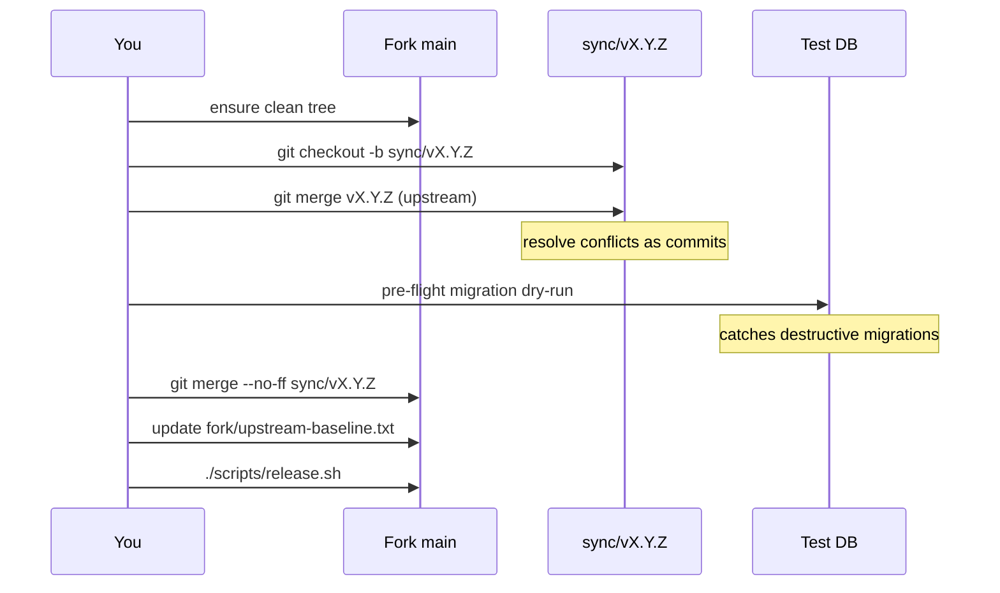

# Upstream sync ritual

Run this every ~2 months (or when an upstream release lands that you want). It pulls a new upstream release tag into the fork and produces a clean merge commit on `main`.

The script `scripts/sync-upstream.sh` automates most of this — read it before running.

## When to sync

- A new upstream **release tag** has appeared on https://github.com/immich-app/immich/releases.
- You have time to resolve potential conflicts and run the pre-flight migration check (allow ~30 min minimum, sometimes much more if upstream did a big refactor).
- The fork's `main` is clean (no uncommitted work, no in-flight feature branches that haven't been merged yet — finish those first or stash them).

**Never sync from `upstream/main`.** Only release tags. See [agents.md §9.1](./agents.md#91-why-we-dont-track-upstream-main).

## Procedure



### 1. Fetch upstream

```bash
cd ~/Projects/immich/immich-src
git fetch upstream --tags --no-tags --prune
git fetch upstream tag vX.Y.Z      # the specific tag you want
```

We don't pull all upstream tags by default to keep the local refs clean.

### 2. Create the sync branch

```bash
git checkout main
git pull --ff-only origin main
git checkout -b sync/vX.Y.Z
```

### 3. Merge the upstream tag

```bash
git merge --no-ff vX.Y.Z -m "merge upstream vX.Y.Z"
```

If conflicts appear, **resolve them as commits** (do not abort and rebase). Each conflict resolution is a real commit on `sync/vX.Y.Z` that becomes part of the audit trail.

```bash
# fix conflicts in your editor
git add <files>
git commit
```

### 4. Pre-flight migration check

The most dangerous part of any sync. Upstream sometimes drops columns or rewrites tables in ways that aren't reversible.

```bash
./scripts/sync-upstream.sh --check-migrations vX.Y.Z
```

This script:
1. Spins up a throwaway Postgres container.
2. Restores the latest prod DB backup from `${UPLOAD_LOCATION}/backups/`.
3. Builds the server image at the new HEAD with `BUILD_ID=preflight-vX.Y.Z`.
4. Runs the server's migration phase against the throwaway DB.
5. Records every migration applied and any `DROP COLUMN`, `DROP TABLE`, or destructive `ALTER`.
6. Exits non-zero if a destructive migration is detected. You then decide:
   - Accept the loss → continue.
   - Skip this sync → `git checkout main && git branch -D sync/vX.Y.Z`.
   - Patch the fork to preserve the lost data → add a fork-only migration before the destructive upstream one.

### 5. Update fork metadata

```bash
echo "vX.Y.Z" > fork/upstream-baseline.txt
git add fork/upstream-baseline.txt
git commit -m "chore(fork): bump upstream baseline to vX.Y.Z"
```

Add a row to [`fork/changelog.md`](./changelog.md) under `## Upstream syncs` with the date and any notable conflicts/destructive migrations from step 4.

### 6. Merge into main

```bash
git checkout main
git merge --no-ff sync/vX.Y.Z -m "merge sync/vX.Y.Z"
git push origin main
git branch -d sync/vX.Y.Z
```

The `--no-ff` keeps the sync as an explicit merge commit even if the resolution was trivial.

### 7. Tag and build the new personal release

```bash
./scripts/release.sh
```

This reads `fork/upstream-baseline.txt`, sees `vX.Y.Z`, and tags `vX.Y.Z-personal.1`. See [release.md](./release.md).

### 8. Deploy

Bump `IMMICH_VERSION` in `~/Projects/immich/immich-app/.env` to the new tag, then `cd ../immich-app && ./scripts/deploy.sh`. See [deployment.md](./deployment.md).

**Always take a fresh DB backup before deploying a synced version.** The pre-flight check minimizes risk but doesn't eliminate it.

## Backporting a CVE fix between syncs (rare)

If upstream lands a security fix on `main` that you can't wait until next sync for:

```bash
git fetch upstream
git log upstream/main --oneline -- <relevant-path>
git checkout main
git cherry-pick <upstream-sha>
# resolve conflicts if any
```

Add an entry under "Security" in [`fork/changelog.md`](./changelog.md). Don't cherry-pick anything that requires DB schema changes — wait for the next release tag instead.

## When a sync is too painful

If conflict resolution is taking longer than the value of the new release, abort and skip:

```bash
git checkout main
git branch -D sync/vX.Y.Z
```

Note in [`fork/changelog.md`](./changelog.md) that you skipped this release and why.
